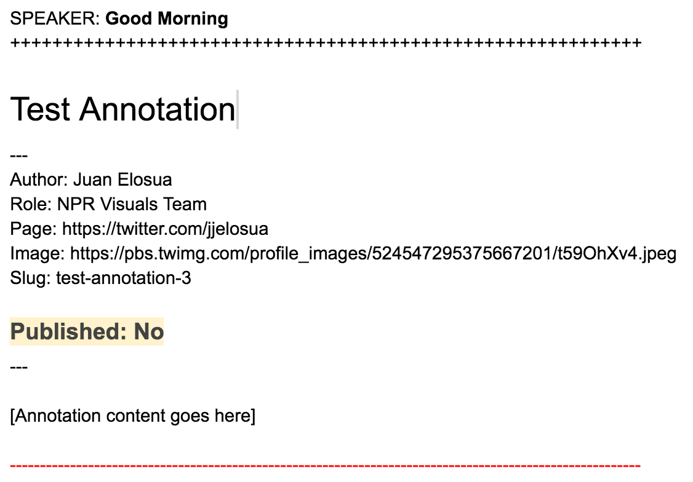
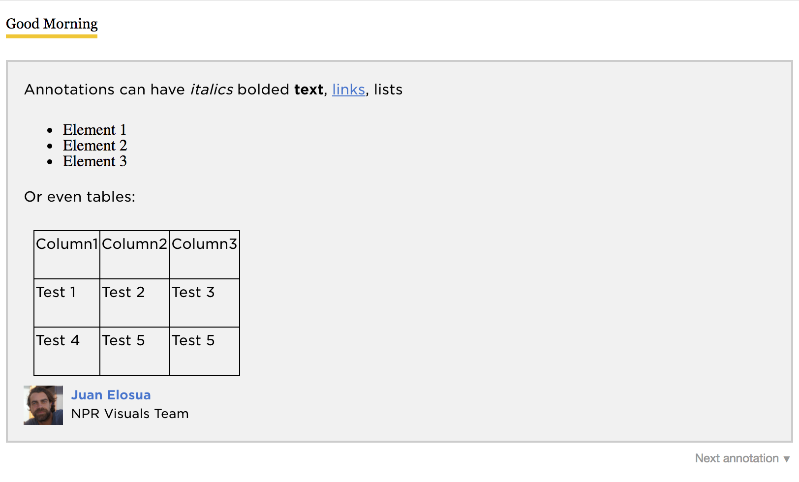
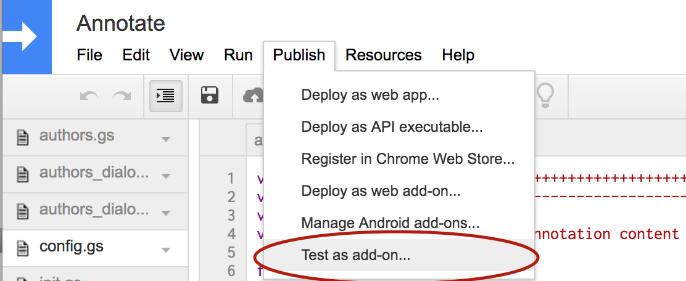

AnnotationAddon
========================

* [What is this?](#what-is-this)
* [Assumptions](#assumptions)
* [What's in here?](#whats-in-here)
* [Hide project secrets](#hide-project-secrets)
* [Run the project](#run-the-project)
* [Google Apps Scripts development](#google-apps-scripts-development)
* [Google Document Permissions](#google-document-permissions)
* [License and credits](#license-and-credits)

What is this?
-------------

Google Docs Addon to add annotations

The Addon has three functionalities:
* Set Authors Spreadsheet (*required*): Used to add an external accesible spreadsheet that will contain the authors of the annotations. it requires a certain schema. You can find an example [here](https://docs.google.com/spreadsheets/d/18dzZhuqnoz2e2Y7TBfYYAuhgK8SRwPEPpEGL1Sl9Rng/edit?usp=sharing)
* Set Sidebar Logo (optional): Used to add a logo to the annotation sidebar
* Add Annotation: Used to insert the annotations inside the document

Each annotation consists of:
* start marker: Marks the start of a given annotation
* end marker: Marks the end of a given annotation
* metadata: Metadata for a given annotation including author information and a slug
* placeholder: Placeholder for the annotation text.



When we want to add an annotation to the text we can proceed in two ways:
* Select some text on the document:
    * We should select text of the document that is outside of any other annotation, i.e. nested annotations are not supported. When we add the annotation the selected text will be bolded by the Add-on.
* Place cursor where we want the annotation to appear in:
    * The annotation will be added directly below our cursor.

Even though it can be used for other purposes it was developed to be combined with NPR factcheck rig, you can find more information of how to use that rig [here](https://github.com/nprapps/debates)



The source of the annotation Add-on is inside the `annotate` folder, the rest of the repo contains development tools that will allow us to upload the google app script project using our own oAuth credentials.

Assumptions
-----------

The following things are assumed to be true in this documentation.

* You are running OSX.
* You are using Python 2.7. (Probably the version that came OSX.)
* You have [virtualenv](https://pypi.python.org/pypi/virtualenv) and [virtualenvwrapper](https://pypi.python.org/pypi/virtualenvwrapper) installed and working.
* You have NPR's AWS credentials stored as environment variables locally.

For more details on the technology stack used with the app-template, see our [development environment blog post](http://blog.apps.npr.org/2013/06/06/how-to-setup-a-developers-environment.html).

What's in here?
---------------

The project contains the following folders and important files:

* ``annotate`` -- Google Apps Script Add-On source files
* ``fabfile`` -- [Fabric](http://docs.fabfile.org/en/latest/) commands for automating setup, deployment, data processing, etc.
* ``templates`` -- HTML ([Jinja2](http://jinja.pocoo.org/docs/)) templates, to be compiled locally.
* ``app.py`` -- A [Flask](http://flask.pocoo.org/) app for rendering the project locally.
* ``app_config.py`` -- Global project configuration for scripts, deployment, etc.
* ``render_utils.py`` -- Code supporting template rendering.
* ``requirements.txt`` -- Python requirements.

Bootstrap the project
---------------------

```
cd annotationAddon
mkvirtualenv annotationAddon
pip install -r requirements.txt
```

**Problems installing requirements?** You may need to run the pip command as ``ARCHFLAGS=-Wno-error=unused-command-line-argument-hard-error-in-future pip install -r requirements.txt`` to work around an issue with OSX.

Hide project secrets
--------------------

Project secrets should **never** be stored in ``app_config.py`` or anywhere else in the repository. They will be leaked to the client if you do. Instead, always store passwords, keys, etc. in environment variables and document that they are needed here in the README.

Any environment variable that starts with ``$PROJECT_SLUG_`` will be automatically loaded when ``app_config.get_secrets()`` is called.

Run the project
---------------

A flask app is used to run the project locally. It will automatically recompile templates and assets on demand.

```
workon annotationAddon
fab app
```

Visit [localhost:8000](http://localhost:8000) in your browser.

Google Apps Scripts Development
-------------------------------

We use our codebase stored on github as the master for the Google Apps Scripts code. We have created a series of Fabric commands to ease the workflow of updating the actual code run inside google drive.

## List projects

```
fab gs.list_projects
```

It will return a complete list of Google Apps Script projects. It accepts and optional owner parameter to filter out the results to a given owner. for example the following command will return only the projects that you have created:

```
fab gs.list_projects:me
```

## Create project

If you want to create the project on your own drive, first inside `app_config.py` update `DRIVE_PARENT_FOLDER_ID` to reflect one existing folder where you want the standalone script to live in. Then you can run:

```
fab [ENVIRONMENT] gs.create
```

This will create a new google apps script project on a subfolder that will depend on the ÈNVIRONMENT used `development` or `production`.

Imagine your root folder on drive is called `scripts`. The fabric tasks expect the following folder structure:

```
scripts
| development
| production
```

## Test as an Add-On

While you are developing changes to the google apps script, we strongly recommend that you use the `Publish -> Test as add-on` option on the project until you are happy with the results.



## Upsert project

If you want to update local changes to a Google Apps Script Project you can run:

```
fab [ENVIRONMENT] gs.upsert
```

Where `ENVIRONMENT` can be: `development` or `production`. Depending on the environment passed the command will update the appropriate Google App Script Project using `app_config` properties. For development it would be:

```
fab development gs.upsert
```

Google Document Permissions
---------------------------

We are accessing the Live Fact Check document from the server to pull out its content using credentials associated with `nprappstumblr@gmail.com` we need to make sure that `nprappstumblr@gmail.com` has at least read access to the document in order to avoid a `403` response to the server.

License and credits
---------
Released under the MIT open source license. See ``LICENSE`` for details.


Contributors
---------
See ``CONTRIBUTORS``
